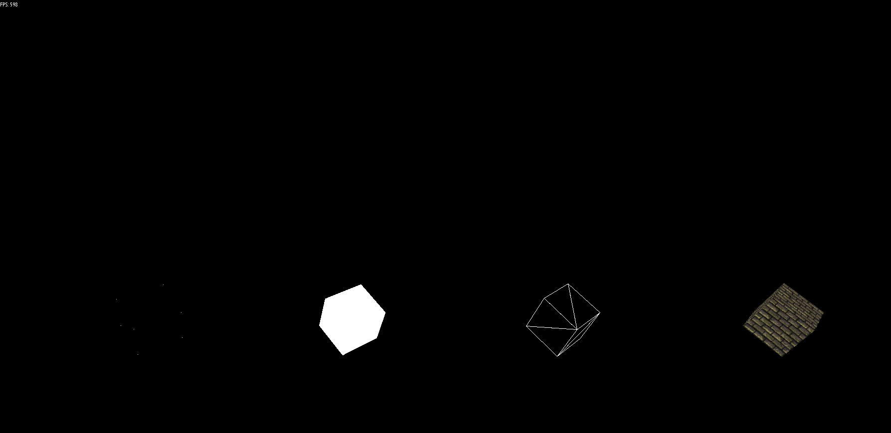

# Real-Time 3D software rendering library for C++
## About this project 
This is my final year project for University. I chose to make a rendering library as I have always had an interest in games and wanted to learn about how the graphics engines eork underneath. While software renderers are rarely used these days I felt that I would gain more knowledge and a better understanding of rendering by programming the functionality that API's and GPU's offer.  

The source code of the build is in the Real-Time-Rendering folder. It can be built as both a shared and static library. In the current build setup it is linked into the demo as a dll.

The code should provided multiplatform (though compiler options may need to be provided for std::Thread to work on some platforms). However, I have not tested it on anything but Windows (which was the OS of the target machine the University  designated for this project).

## Extra information about this project 
This was my first big project in C++ (we were taught Java and were required to complete most of out projects in it) and as such this project will have some code in it that contains bad practices and C++ specific errors. Some of which I am aware of (but learnt about too late in development to fix), and likely many of which I am unaware of. While I could fix some of these now, I prefer to leave the project in the state is was in when it was handed in. The same goes for the mathematics involved; there are some mistakes I am aware of and likely several I am not. Due to time constaints some of the code is a mess (ObjectParser is a good example) and needs cleaning up. I have learnt a lot more about code design since finishing this project.

There is some very barebones documentation available in the documentation folder.

## Running this project
The project can be built with CMAKE.

For the purposes of demoing this app I have included the release build files in this repo (generally a bad practice). To run the demo goto Demo Build > demo.exe. The demo will show 4 cubes by default and you can move around with mouse and keyboard. However, the demo was mainly designed to work with an xbox 360 controller (So I could stand up while presenting the demo and let others try it while I presented). The file that creates the 

* Analog sticks work like first person game controls.
* Press left bumper on a 360 pad to switch between a few different model settings. 
* Press right bumper to reset the camera.
* Press A to toggle backface culling.

## Images of the project in action
### The four rendering modes

### A model loaded from a .obj file

### A wireframe cube with backface culling turned off

### A textured cube, showing the affects of affine texture warp
Affine texture mapping was used instead of perspective correct texturing for performance reasons (and it gives me nostalgia for the look of early real-time 3D games!)
